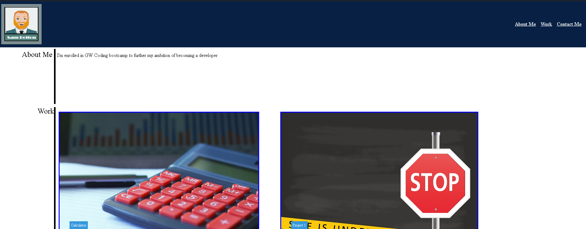

# Personal Portfolio Website

This project is my porfolio website demonstrating my abilities, coding experience, and contact information.  It gives potentioal employers a view into what I can bring to the table.

-Feature
-Usage

## Features
-responsive design
-projects
-contact info

## Usage
view the webiste:  https://s-bolt.github.io/Portfolio/

License
This project is licensed under the MIT License. Feel free to use, modify, and distribute the code for personal or commercial projects.